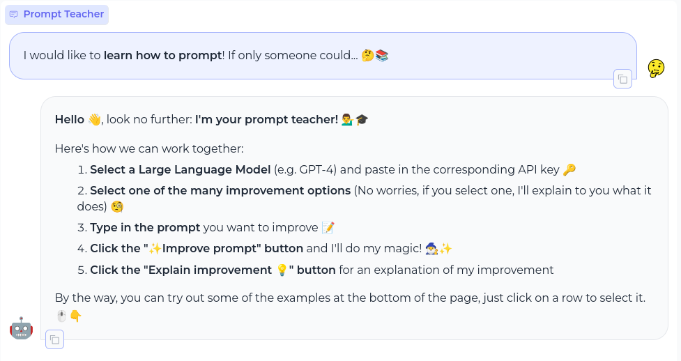

# 🤖 Prompt Teacher 📝✨

> The **prompt teacher** is an interactive and educational prompt engineering interface for LLMs that teaches users how to craft ✍️, refine 🔧, and optimize 📈 prompts to achieve the most effective and targeted responses from LLMs.



## Quickstart 🚀

### 👉 Click here to try out the app directly without any setup:
[**Prompt Teacher @ Huggingface Spaces**](https://pwenker-prompt-teacher.hf.space/)

### 🔍 Inspect code at:
- **GitHub:** [pwenker/prompt_teacher](https://github.com/pwenker/prompt_teacher)
- **Hugging Face Spaces:** [pwenker/prompt_teacher](https://huggingface.co/spaces/pwenker/prompt_teacher)

## Metaprompts Overview

The following metaprompts are currently part of the prompt teacher.


| 🔍 **Name**                       | 📜 **Explanation**                                                                                                  | ✏️ **Example Prompt**                          | 💡 **Example Prompt Explanation**                                                                                          |
|-----------------------------------|--------------------------------------------------------------------------------------------------------------------|-----------------------------------------------|----------------------------------------------------------------------------------------------------------------------------|
| **Expand with details**           | Expands a prompt to include more detailed instructions and context.                                                | Tell me about dogs.                           | This prompt is very vague and lacks context, making it ideal for expansion to guide the LLM more effectively.              |
| **Apply feedback**                | Improves a prompt based on specific feedback provided.                                                             | Describe the process of photosynthesis.       | Feedback might suggest making the prompt more accessible for younger audiences or more detailed for academic use.          |
| **Simply condense prompt**        | Condenses a prompt to make it more succinct while retaining its essential request.                                 | Write a funny joke that makes people laugh about something very funny. It should be hilarious. | This prompt can be condensed by removing redundant information.                                                            |
| **Simply improve prompt**         | Improves a prompt to enhance clarity and effectiveness.                                                            | Tell me how to cook rice.                     | This prompt can be improved by specifying the type of cuisine or cooking method.                                           |
| **Create sequential task list**   | Structures a prompt to guide the LLM through a series of sequential tasks.                                         | Plan a birthday party.                        | This prompt can be structured to outline steps such as choosing a theme, preparing a guest list, and organizing activities.|
| **Elicit creative response**      | Transforms a prompt to inspire creativity and elicit imaginative responses.                                         | Write a story about a lost kitten.            | The prompt can be revised to encourage more descriptive or emotional storytelling.                                         |
| **Include hypothetical scenario** | Tailors a prompt to include a specific hypothetical scenario for detailed exploration.                             | The danger of Artificial General Intelligence | This prompt can be tailored to explore specific hypothetical scenarios to provide depth and context.                       |
| **Focus on ethics**               | Reframes a prompt to focus on ethical considerations or moral dilemmas.                                            | Genetic engineering in humans.                | This prompt can be reframed to focus on the ethical considerations or moral dilemmas involved.                             |
| **Add role prompting**            | Adds a role to the prompt to improve the response.                                                                 | Write a short song.                           | By adding an expert role, we can potentially improve the quality of the created song.                                      |
| **Add delimiters for clarity**    | Adds clear delimiters to a prompt to separate and organize different sections or instructions, enhancing readability and structure. | Summarize this text {text} with bulletpoints. Be concise | This prompt can benefit from clear delimiters to separate instructions or sections, making it easier for the LLM to follow and respond systematically. |
| **Incorporate chain of thought reasoning** | Incorporates chain of thought reasoning to guide the LLM through a logical sequence of thoughts for complex problem-solving. | How can we reduce traffic congestion in urban areas? | This prompt can benefit from chain of thought reasoning to break down the problem into manageable parts and explore various solutions systematically. |
| **Comprehensive prompt refinement** | Integrates various techniques to refine, expand, and adapt prompts for LLMs, ensuring clarity, specificity, and engagement tailored to the intended purpose. | Write a brief history of Artificial Intelligence | This prompt can be improved by specifying aspects such as the depth of detail, areas of focus, and desired structure.       |

## Local Deployment 🏠

### Prerequisites 📋

#### Rye 🌾
[Install `Rye`](https://rye-up.com/guide/installation/#installing-rye)
> Rye is a comprehensive tool designed for Python developers. It simplifies your workflow by managing Python installations and dependencies. Simply install Rye, and it takes care of the rest.


### Secrets Management  🔑

- Create an environment file: `.env` in the `prompt_teacher` folder and add the following variables:

```
OPENAI_API_KEY=... # Token for the OpenAI API
ANTHROPIC_API_KEY=... # Token for the Anthropic API
```

### Set-Up 🛠️

Clone the repository, e.g. with:
```
git clone https://github.com/pwenker/prompt_teacher.git
```
Navigate to the directory:
```
cd prompt_teacher
```
And execute:
```
rye sync
```
This creates a virtual environment in `.venv` and synchronizes the repo.

For more details, visit: [Basics - Rye](https://rye-up.com/guide/basics/)

### Start the App 🌟

> [!NOTE]  
> If you choose to install `prompt_teacher` without `rye` just omit `rye run` for the following commands.

Launch the app using:
```
rye run python src/prompt_teacher/app.py
```

Finally, open your browser and visit [http://localhost:7860](http://localhost:7860/) to start prompting!
